# Azure Just-in-Time VM Access Security Lab


A hands-on Azure security lab demonstrating how to secure virtual machines using **Just-in-Time (JIT) VM Access** with **Microsoft Defender for Cloud**.  

This project shows how cloud administrators can **reduce attack surfaces by restricting management ports like RDP (3389)** and only allowing temporary access when required.

---

# Architecture Diagram

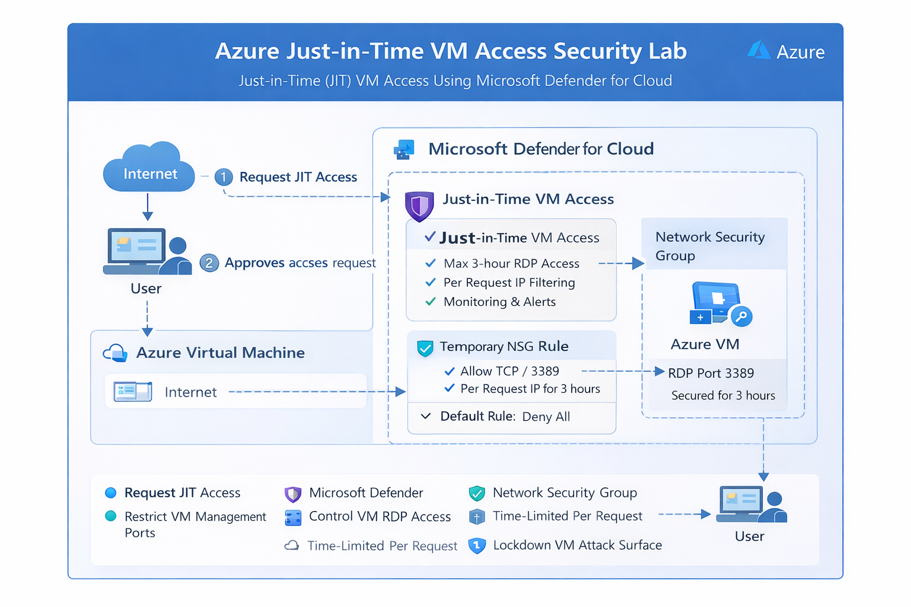

This architecture demonstrates how **Microsoft Defender for Cloud dynamically controls RDP access** to Azure Virtual Machines using temporary Network Security Group rules.

# Flow Overview

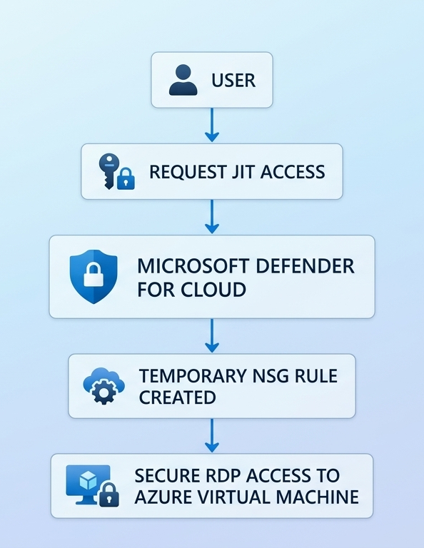

---

# Technologies Used

- Microsoft Azure
- Microsoft Defender for Cloud
- Azure Virtual Machines
- Network Security Groups (NSG)
- Just-in-Time VM Access
- Windows Server
- Remote Desktop Protocol (RDP)

---

# Lab Environment

Resource Group:

```
AZ500-JIT-Lab-RG-1
```

Resources used in this lab:

- Azure Virtual Machine
- Microsoft Defender for Cloud
- Network Security Group
- Just-in-Time Access Policy

---

# Step 1 : Enable Microsoft Defender for Cloud

First enable the **Microsoft Defender Plan for Servers**.

This service provides advanced security capabilities including:

- Threat detection
- Security recommendations
- Just-in-Time VM Access

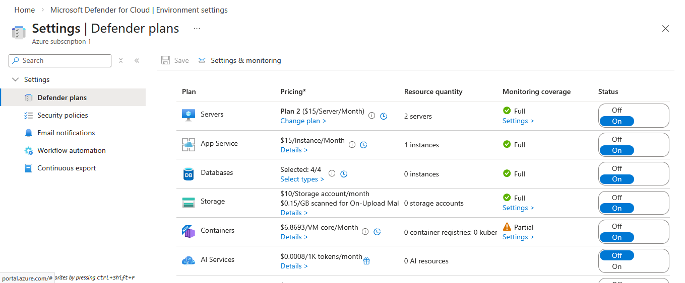

---

# Step 2 : Configure Just-in-Time VM Access

Navigate to:

```
Microsoft Defender for Cloud
→ Workload Protections
→ Just-in-Time VM Access
```

Select the target virtual machine and enable JIT protection.

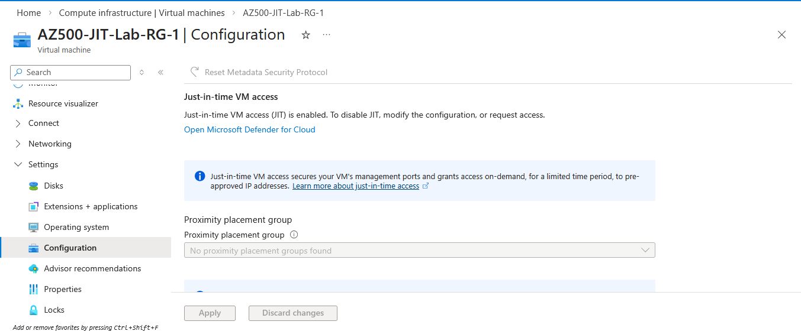

---

# Step 3 : Configure JIT Access Rules

Define the ports that should be protected by JIT.

Example configuration:

Port: 3389  
Protocol: TCP  
Allowed Source: Per Request  
Maximum Request Time: 3 Hours  

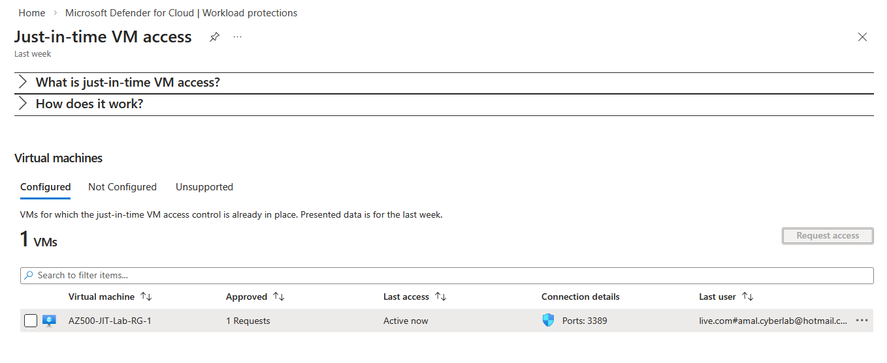

---

# Step 4 : Configure Network Security Group

Create an inbound rule for the virtual machine.

Example rule configuration:

Protocol: TCP  
Port: 3389  
Action: Allow  
Priority: 100  
Rule Name: Allow-RDP-For-JIT  

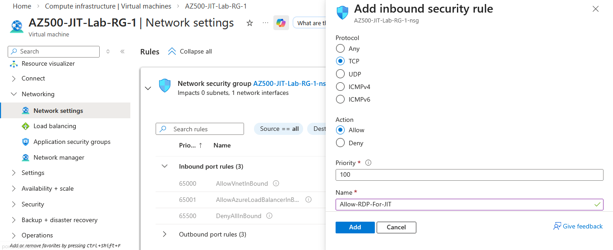

---

# Step 5 : Request Temporary Access

From the **JIT VM Access panel**, request access to the virtual machine.

Example request configuration:

Port: 3389  
Allowed Source: My IP  
Access Time: 1 Hour  

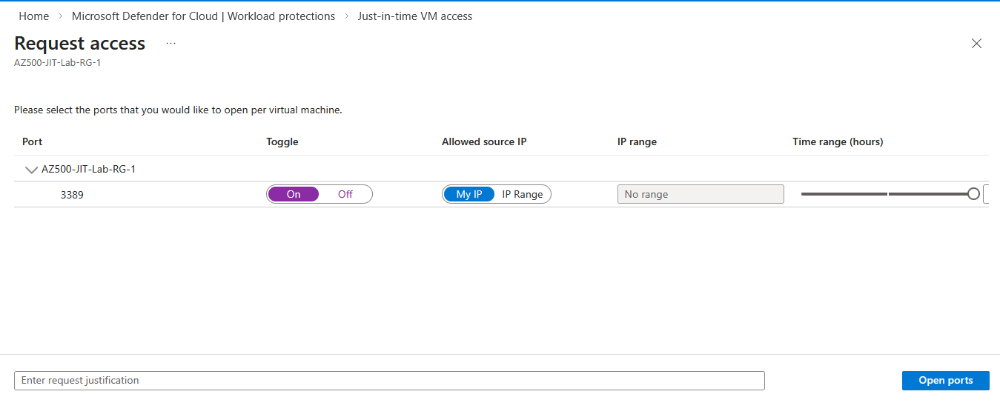

---

# Step 6 : Active JIT Session

Once approved, **Microsoft Defender automatically creates a temporary NSG rule** allowing access for the requested time period.

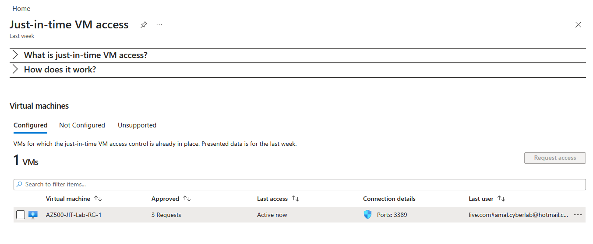

---

# Security Testing

Before requesting JIT access:

Remote Desktop connection is **blocked**.

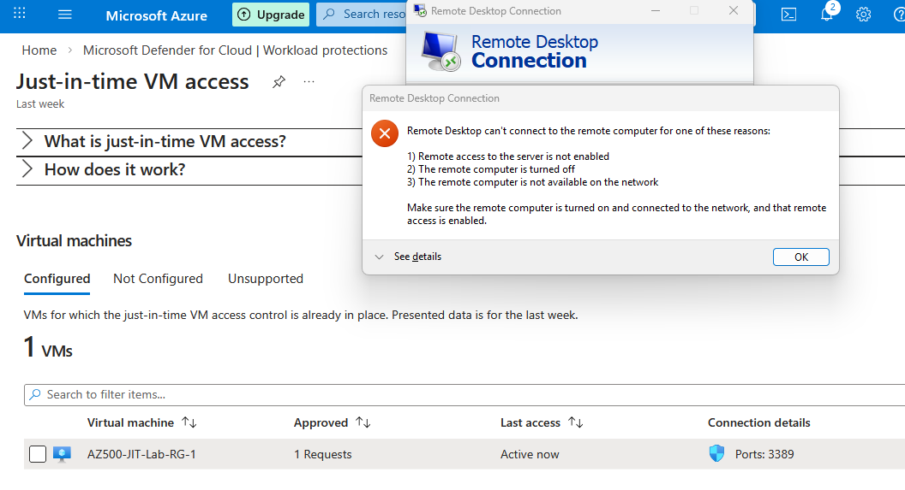

After requesting JIT access:

RDP connection is **successfully established**.

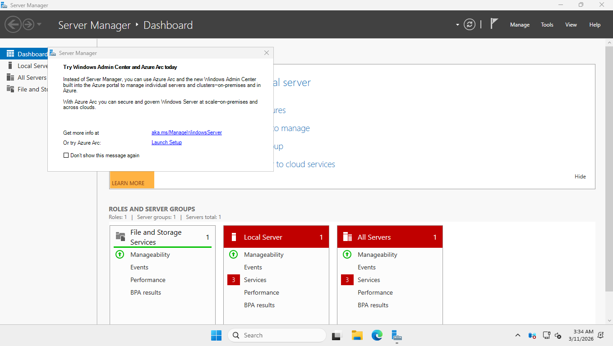

This confirms that **Just-in-Time VM Access is functioning correctly**.

---

# Security Benefits

- Reduces exposed attack surface
- Protects RDP ports from brute-force attacks
- Provides time-limited administrative access
- Improves Azure VM security posture

---

# Learning Objectives

This lab demonstrates:

- Microsoft Defender for Cloud security features
- Just-in-Time VM Access configuration
- Azure VM security best practices
- Network Security Group configuration
- Secure remote access architecture

---

# Project Structure

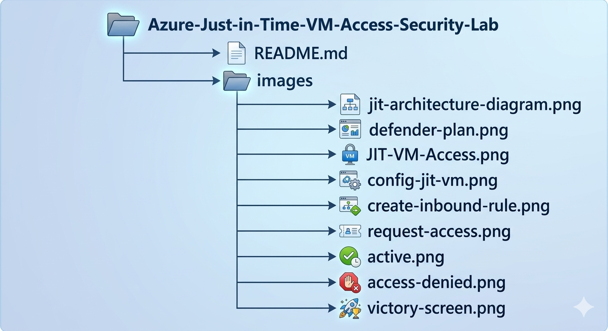


---

# Author

**Amal Udayanga Basnayake**

Cloud & Cybersecurity Enthusiast  
Azure Security Learner  

GitHub  
https://github.com/AmalUBasnayake

Medium  
https://medium.com/@amalubasnayake

LinkedIn  
https://www.linkedin.com/in/amal-udayanga-basnayake
